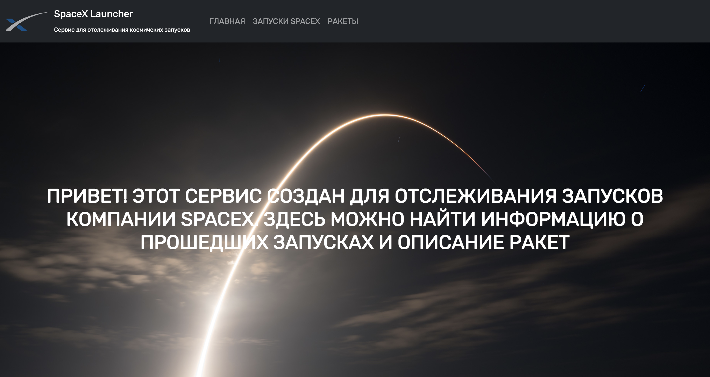
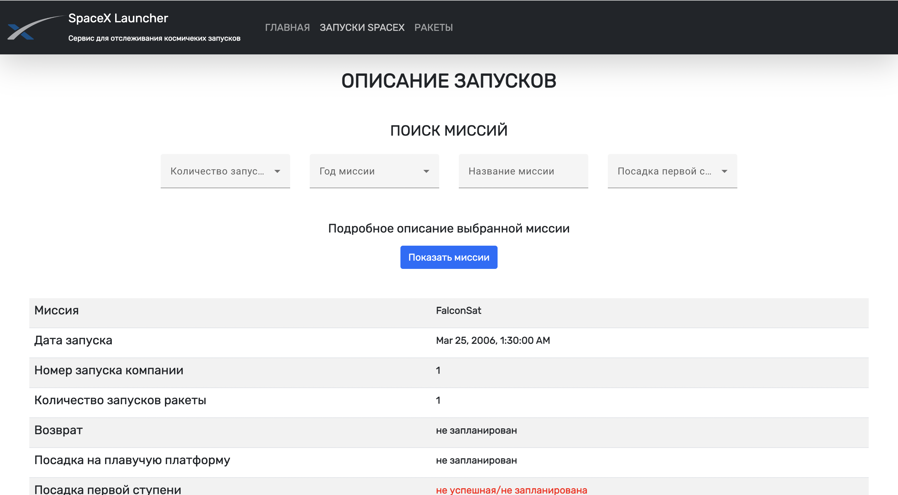
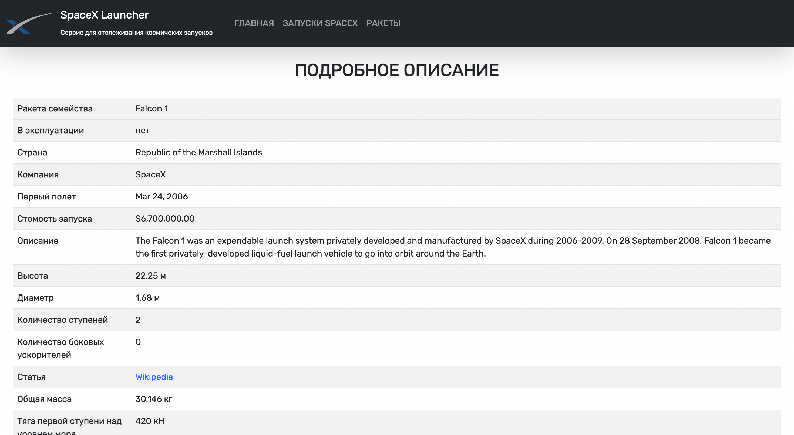

# [Сервис SpaceXLauncher](https://develop-test--charming-marshmallow-66ac51.netlify.app)

### Данный сервис позволяет отслеживать запуски компании SpaceX 

# Как использовать

1. Склонируйте репозиторий `git clone https://github.com/DaniilRyb/SpaceXLauncher.git`

2. Установите необходимые модули `npm i`

3. Установите Angular глобально, если он у вас не установлен `npm install -g @angular/cli`

4. Запустите проект командой `ng serve`

5. Пройдите по ссылке в браузере `http://localhost:4200/`

# Service SpaceXLauncher
### This service allows you to track SpaceX launches

# How to use

1. Clone the `git clone' repository https://github.com/DaniilRyb/SpaceXLauncher.git `

2. Install the necessary `npm i` modules

3. Install Angular globally if you don't have `npm install -g @angular/cli` installed

4. Run the project with the `ng serve` command

5. Follow the link in the browser `http://localhost:4200 /`

## This project was generated with [Angular CLI](https://github.com/angular/angular-cli) version 15.1.1.
